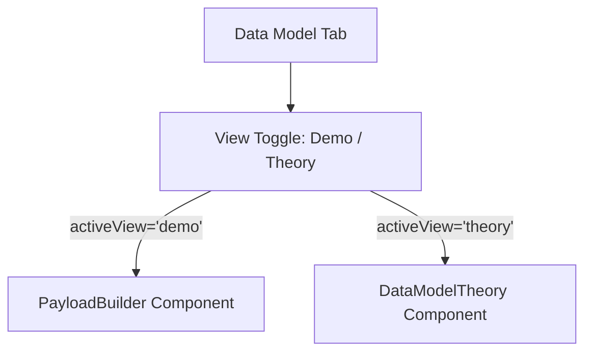

# PLAN: Data Model Theory Integration (Option A)

## Context
Add a "Theory" section to Tab 4 (Data Model) using a sub-tab/toggle approach. The user wants to switch between a "Demo" (existing `PayloadBuilder`) and a "Theory" (new visualization) view without altering the original functionality.

## Phase 0: Socratic Gate (COMPLETED)

- **State Preservation:** YES (Demo forms and logs will be preserved when switching views).
- **Toggle Placement:** YES (Switch will be placed at the top of the content area).
- **Diagram Interactivity:** YES (Clean, simple animation for the "Two Ingestion Paths").

## Phase 1: Architecture & Design

### Component Structure
The "Data Model" tab currently only renders `<PayloadBuilder />`. We will introduce a local state `activeView` ('demo' | 'theory') within `src/app/page.tsx` or a wrapper.

### Aesthetic Strategy
- **Toggle:** A custom floating switch with a "pill" design, using `bef264` (Lime) for the active state to match the "AtomicKernel" theme.
- **Theory Content:** Use the provided image content but reconstruct the "Two Ingestion Paths" using Framer Motion + SVG for a premium "animated" feel.

## Phase 2: Implementation Steps

### 1. Visualization Component [NEW] 
- Create `src/components/tabs/DataModel/TheoryVisualization.tsx`.
- Implement path A (Integrated) and path B (BYO) using SVG lines and animated particles.

### 2. Theory Content Wrapper [NEW]
- Create `src/components/tabs/DataModel/DataModelTheory.tsx`.
- Layout: Header Title -> Two Ingestion Paths Visualization -> Record/Metadata Text Blocks.

### 3. Integration [MODIFY]
- Update `src/app/page.tsx` (or a dedicated tab wrapper) to handle the `view` state.
- **Safety Polish:** Use `display: none` or `<AnimatePresence>` to hide/show components to ensure `PayloadBuilder` state is preserved if it doesn't use lifted state for everything.

## Phase 3: Verification Plan

### Automated Tests
- N/A (UI visual change).

### Manual Verification
1. Open Tab 4.
2. Toggle to "Theory". Verify visualization animations trigger.
3. Toggle back to "Demo". Verify `PayloadBuilder` shows the previously selected index and any typed text remains.
4. Verify responsive layout (Mobile/Tablet).

---

[OK] Plan created: docs/PLAN-data-model-theory.md
